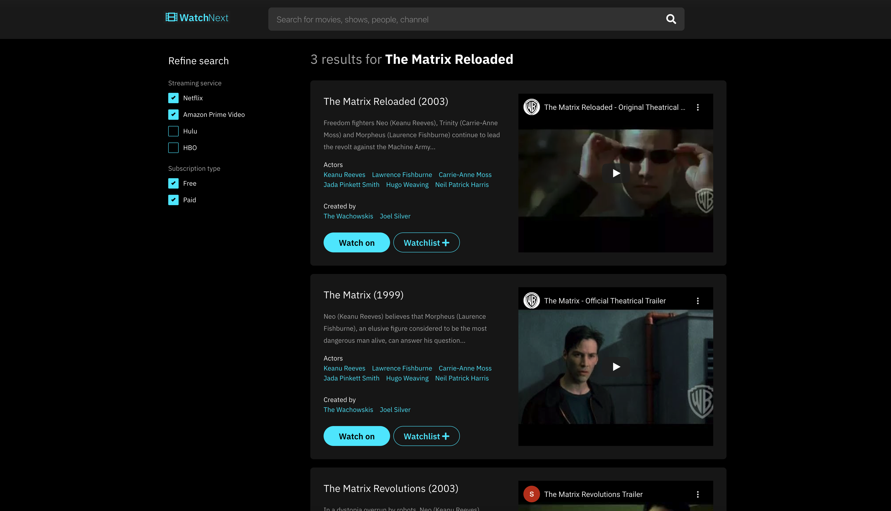
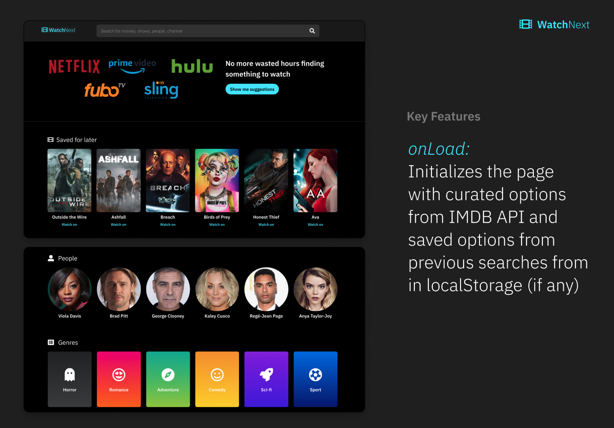
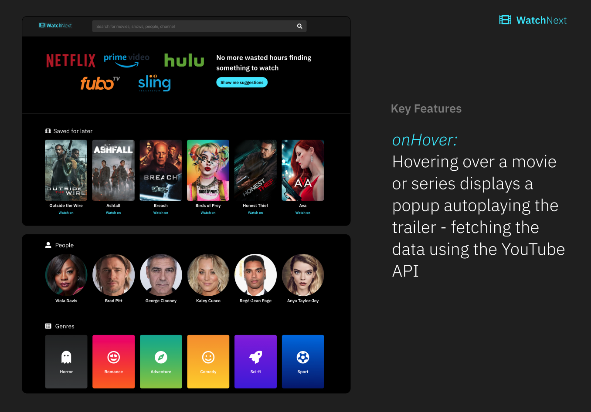
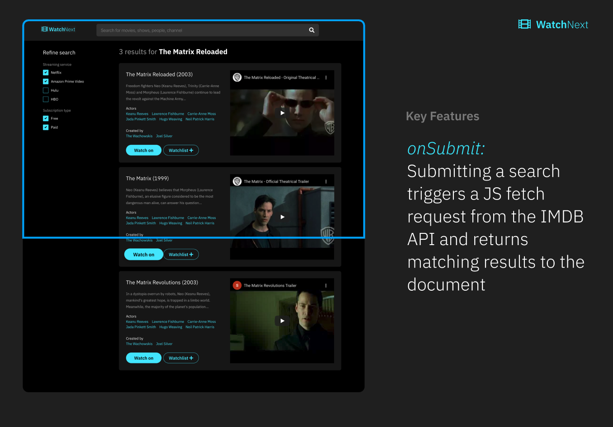
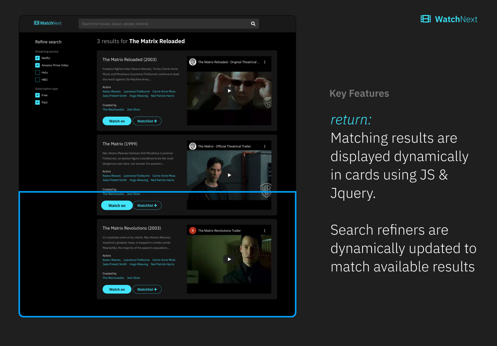
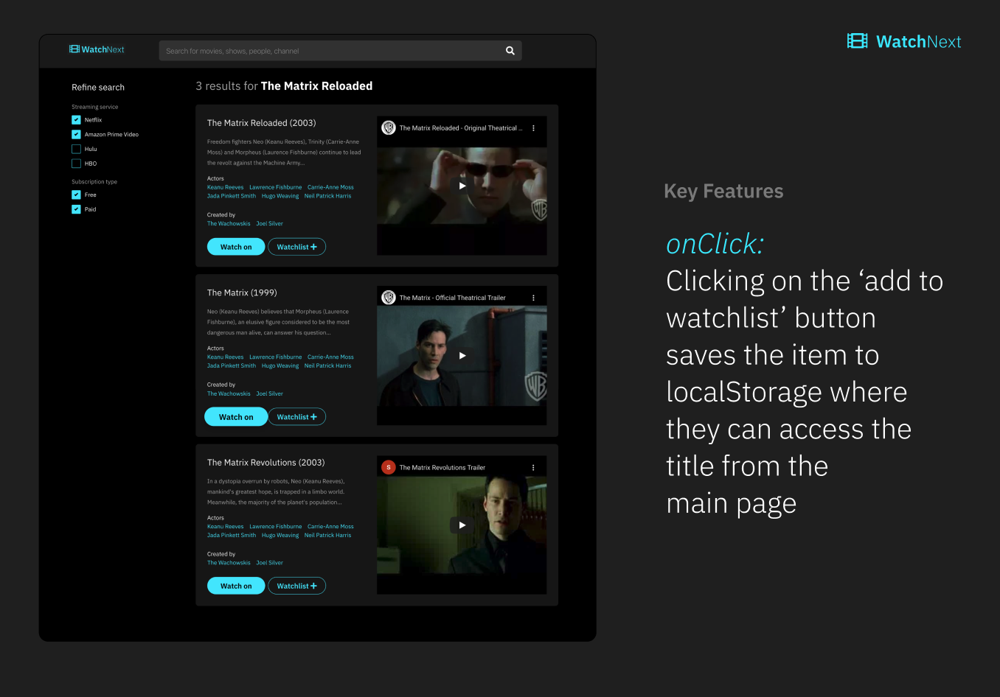
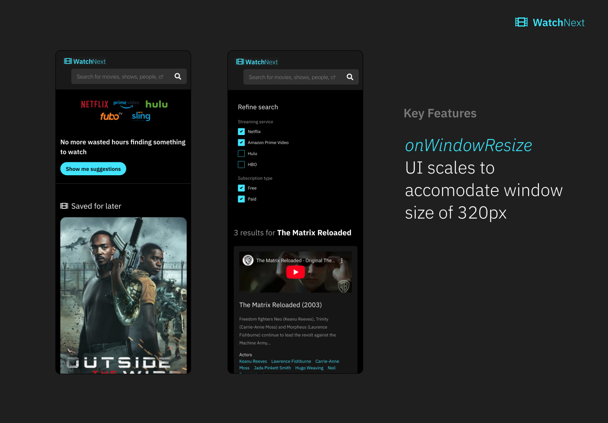

# WatchNext
The application helps the user choose a movie or series over multiple services based on their preferences by retrieving data from [movie API].

<!--INSERT PICTURE HERE-->


<details open="open">
  <summary><h2 style="display: inline-block">Table of Contents</h2></summary>
  <ol>
     <li>
      <a href="https://charvey0.github.io/WatchNext/">View project</a></li>
    <li>
      <a href="#about-the-project">About The Project</a>
      <ul>
        <li>
        <a href="#built-with">Built With</a></li>
      </ul>
    </li>
    <li>
      <a href="#getting-started">Getting Started</a>
      </li>
      <ul>
        <li>
        <a href="#installation">Installation</a>
        </li>
      </ul>
    </li>
    <li><a href="#usage">Usage</a>
    </li>
    <li><a href="#contributing">Contributing</a>
    </li>
    <li><a href="#license">License</a>
    </li>
    <li><a href="#contact">Contact</a>
    </li>
  </ol>
</details>

<!--ABOUT THE PROJECT-->
## About The Project
<!--INSERT PICTURE HERE-->

<br><br><br>
**Built using Javascript, Jquery, HTML, CSS and leveraging a 3rd party API from __. This application allows users to search for a movie or show title based on their preferences of Genre, Actor, or Streaming service. Past searches are stored using localStorage and displayed in a list. Clicking the title displays the information again**
<br><br><br>


### Built With

* [HTML](https://www.w3schools.com/)
* [CSS](https://www.w3schools.com/)
* [Bootstrap](https://getbootstrap.com/docs/4.3/getting-started/introduction/)
* [Javascript](https://www.w3schools.com/)
* [Jquery](https://jquery.com/)
* [FontAwesome](https://fontawesome.com/)
<!--* [Movie API]()-->

<!-- GETTING STARTED -->
## Getting Started
To get a local copy up and running follow these simple steps. You can also download the source files provided. You will need a text editor such as Visual Studio Code, Xcode or similar to edit the source code.

### Installation
1. Clone the repo
   ```sh
   git clone https://charvey0.github.io/WatchNext/
   ```

2. Pull the latest
   ```sh
   git pull

## Usage 
<!--INSERT SCREEN RECORDING HERE-->
#### What's included
HTML, CSS and Javascript files include the source code for running the WatchNext Application.
## Project deliverables

#### Included functionality:







#### HTML, CSS and Javascript & Jquery

<!--LINKS-->
Project repo link: https://github.com/charvey0/WatchNext
<br>
Project website: https://charvey0.github.io/WatchNext/


### Responsive view example - On mobile


<!-- LICENSE -->
## License


<!-- CONTACT -->
## Contact
Adam Stevenson
Cameron Harvey
Kay Davis
Taylor Sanders